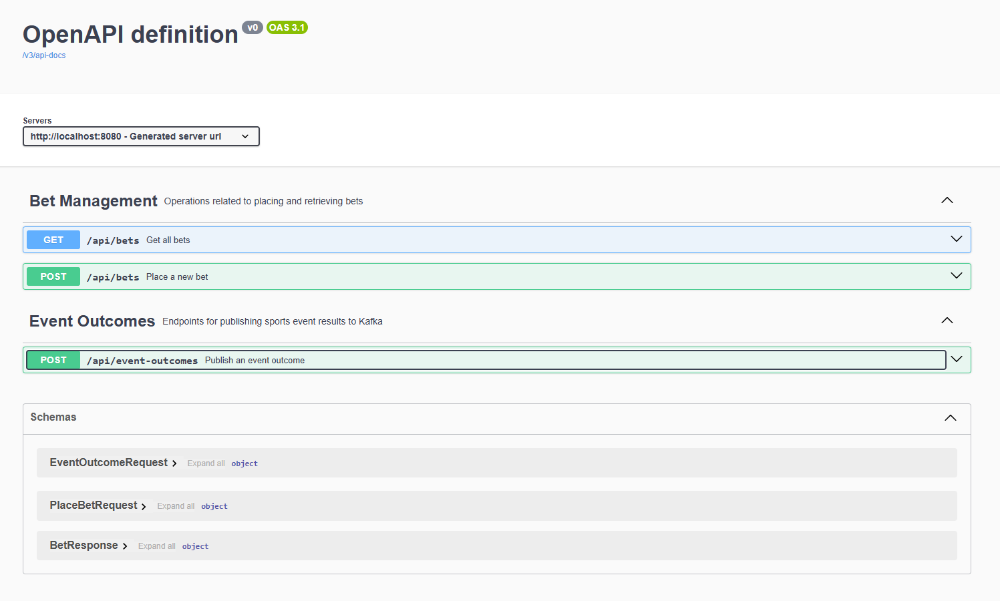
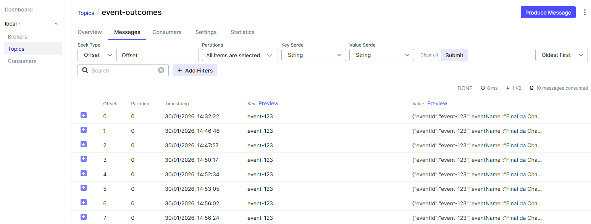
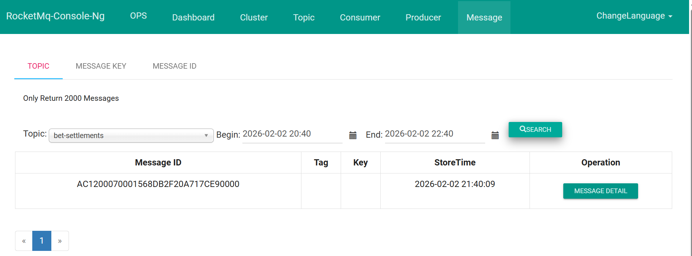
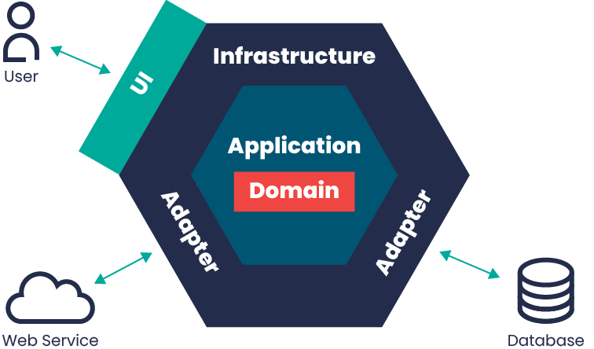

This is a simple backend service built using Java 17, Spring Boot 3 and Kafka as a message broker.


- **Back-end**: The backend is built using Java 17.
- **API**: The service is built using Spring Boot 3
- **Message**: The message broker is built using kafka and RocketMQ to publish messages to a topic
- **Database**: H2 In-Memory Database

**Architecture / sequence diagrams**

- High-level diagram: [sportygroup-seq-diagram.svg](./sportygroup-fundo.svg)

<div style="background-color: white; padding: 15px; border-radius: 8px;">
    
</div>

## Requirements

- **Docker**: 
- **Docker Compose**: 
 

### Getting Started

#### 1. Clone the Repository

Clone this repository to your local machine:

```
git clone https://github.com/Brunolimaa/assigment-sportygroup.git

```

or click in download button in the top right corner of this page to download the project as a zip file.


#### 2. Docker Compose Setup

The project was set up in dockerfile and docker-compose.yml, so you can run the project using Docker Compose.

Doing this the MAVEN build will be executed automatically, and the application will be started in a container.

##### Start the Docker Containers

```
docker-compose up --build 
```
## Testing API - Sportygroup

#### 1. Access the Swagger documentation 

```
http://localhost:8080/swagger-ui/index.html
```


#### 2. CURL in case to test in another platform such as Postman

- **Create a bet at Database**
```
curl -X 'POST' \
  'http://localhost:8080/api/bets' \
  -H 'accept: */*' \
  -H 'Content-Type: application/json' \
  -d '{
  "betId": "bet-998877",
  "userId": "user-456",
  "eventId": "event-123",
  "eventMarketId": "market-001",
  "eventWinnerId": "winner-789",
  "betAmount": 50.00
}'
```

- **List bets from Database**
```
curl -X 'GET' \
  'http://localhost:8080/api/bets' \
  -H 'accept: */*'
```

- **Create a event-outcomes**
```
curl -X 'POST' \
  'http://localhost:8080/api/event-outcomes' \
  -H 'accept: */*' \
  -H 'Content-Type: application/json' \
  -d '{
  "eventId": "event-123",
  "eventName": "Final da Champions League: Real Madrid vs Dortmund",
  "eventWinnerId": "winner-789"
}'
```

##### 2.1 Unit tests and Integration tests
You can run the unit tests and integration tests using the following command:

```
    mvn clean test
```


#### 3. Logs from API - through docker 

Execute this command to follow in real-time logs from api 

```
docker logs -f bet-app

```

###### example:

```
2026-01-30T21:42:48.232Z  INFO 1 --- [bet] [ bet-producer-1] org.apache.kafka.clients.Metadata        : [Producer clientId=bet-producer-1] Cluster ID: Rq7a2WgbQJOeCMwaId31hA
2026-01-30T21:42:48.238Z  INFO 1 --- [bet] [ bet-producer-1] o.a.k.c.p.internals.TransactionManager   : [Producer clientId=bet-producer-1] ProducerId set to 6 with epoch 0
2026-01-30T21:42:48.380Z  INFO 1 --- [bet] [-consumer-0-C-1] c.s.b.i.m.EventOutcomesKafkaConsumer     : Received event outcome from Kafka: topic=event-outcomes, offset=10, payload={"eventId":"event-123","eventName":"Final da Champions League: Real Madrid vs Dortmund","eventWinnerId":"winner-789"}
2026-01-30T21:42:49.171Z  INFO 1 --- [bet] [-consumer-0-C-1] c.s.b.a.s.HandleEventOutcomeService      : [Settlement] Processing results for event event-123: 1 total bets, 1 winners found.
2026-01-30T21:42:49.175Z  INFO 1 --- [bet] [-consumer-0-C-1] c.s.b.i.m.RocketMQBetSettlementProducer   : Successfully sent settlement to RocketMQ: betId=bet-998877

```

#### 4. UI for Apache Kafka

To access the UI you need to access this link: 

```
http://localhost:8081/
```
To see the messages you can find them in these menus: 

##### Topics > Topic Name "sports-live-ipdates" > Messages



#### 5. UI for RocketMQ



To access the UI you need to access this link:

```
http://localhost:8082/
```

## Design decisions

It’s a simple project; however, I decided to use Hexagonal Architecture as the architectural approach.
By using this architecture, it’s possible to isolate the domain and application code, applying the Open/Closed Principle more easily.
For this project, it would have been simpler, of course, to use an MVC architecture, but I chose Clean Architecture to better organize the layers and responsibilities.

- According to this image, we can see how this architecture works 



To handle centralized exceptions, I used AOP (Aspect-Oriented Programming) through @ControllerAdvice or @ExceptionHandler.

Another design decision was applying Dependency Inversion, by defining interfaces as contracts to avoid direct dependencies on concrete classes.

I also centralized the entire OpenAPI documentation in an interface, mainly to apply the Single Responsibility Principle.
This approach helps to keep the code standardized, easier to understand, and more maintainable.

## AI-assisted

To speed up the development process, I utilized GitHub Copilot to generate basic unit tests and initial class descriptions. This approach was essential for maintaining high coding standards and keeping the project well-organized.

My role involved reviewing and validating every line of code and test produced by the AI to ensure accuracy. Additionally, I refined the class descriptions whenever they needed more detail or clarity. Beyond coding, Copilot assisted me with essential environment configurations, such as setting up Docker Compose.


